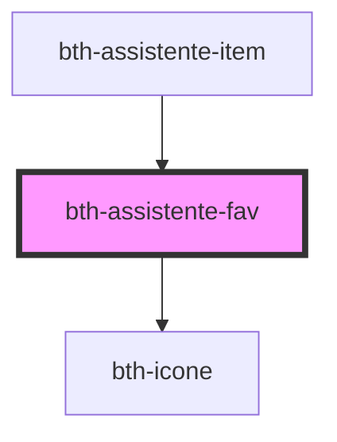

# bth-assistente-fav

<!-- Auto Generated Below -->

## Properties

| Property        | Attribute       | Description                                 | Type      | Default     |
| --------------- | --------------- | ------------------------------------------- | --------- | ----------- |
| `ativo`         | `ativo`         | Ativo?                                      | `boolean` | `undefined` |
| `identificador` | `identificador` | Identificador É enviado no evento de click. | `string`  | `undefined` |

## Events

| Event        | Description         | Type               |
| ------------ | ------------------- | ------------------ |
| `favClicked` | É emitido ao clicar | `CustomEvent<any>` |

## Dependencies

### Used by

 - [bth-assistente-item](../assistente-item)

### Depends on

- [bth-icone](../../comuns/icone)

### Graph

----------------------------------------------

Esta documentação é gerada automáticamente pelo StencilJS =)
