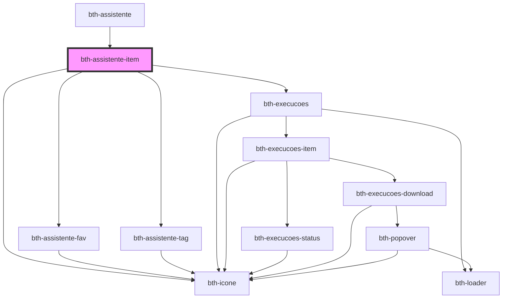

# bth-assistente-item

<!-- Auto Generated Below -->

## Properties

| Property        | Attribute       | Description                                                                                                         | Type                  | Default     |
| --------------- | --------------- | ------------------------------------------------------------------------------------------------------------------- | --------------------- | ----------- |
| `authorization` | --              | Configuração de autorização. É necessária para o componente de execucoes poder realizar autentizar com os serviços. | `AuthorizationConfig` | `undefined` |
| `descricao`     | `descricao`     | Descrição                                                                                                           | `string`              | `undefined` |
| `extensaoId`    | `extensao-id`   | Identificador da extensão                                                                                           | `string`              | `undefined` |
| `favorito`      | `favorito`      | Favorito                                                                                                            | `boolean`             | `undefined` |
| `icone`         | `icone`         | Ícone                                                                                                               | `string`              | `undefined` |
| `identificador` | `identificador` | Identificador                                                                                                       | `string`              | `undefined` |
| `tags`          | --              | Tags                                                                                                                | `Tag[]`               | `[]`        |

## Dependencies

### Used by

 - [bth-assistente](..)

### Depends on

- [bth-assistente-fav](../assistente-fav)
- [bth-icone](../../comuns/icone)
- [bth-assistente-tag](../assistente-tag)
- [bth-execucoes](../execucoes)

### Graph

----------------------------------------------

Esta documentação é gerada automáticamente pelo StencilJS =)
