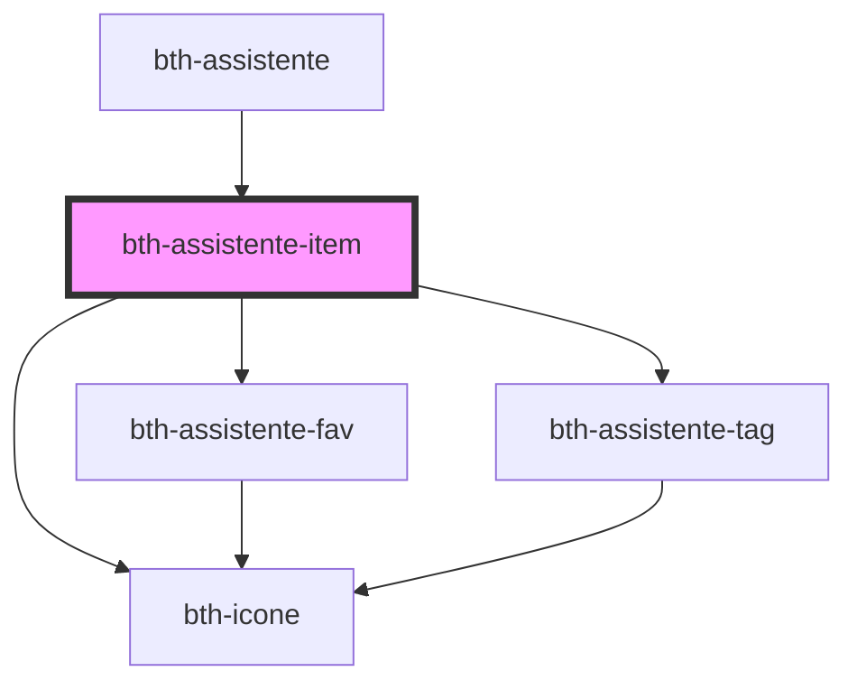

# bth-assistente-item

<!-- Auto Generated Below -->

## Properties

| Property        | Attribute       | Description   | Type      | Default     |
| --------------- | --------------- | ------------- | --------- | ----------- |
| `descricao`     | `descricao`     | Descrição     | `string`  | `undefined` |
| `favorito`      | `favorito`      | Favorito      | `boolean` | `undefined` |
| `icone`         | `icone`         | Ícone         | `string`  | `undefined` |
| `identificador` | `identificador` | Identificador | `string`  | `undefined` |
| `tags`          | --              | Tags          | `Tag[]`   | `[]`        |

## Dependencies

### Used by

 - [bth-assistente](..)

### Depends on

- [bth-assistente-fav](../assistente-fav)
- [bth-icone](../../comuns/icone)
- [bth-assistente-tag](../assistente-tag)

### Graph

----------------------------------------------

Esta documentação é gerada automáticamente pelo StencilJS =)
