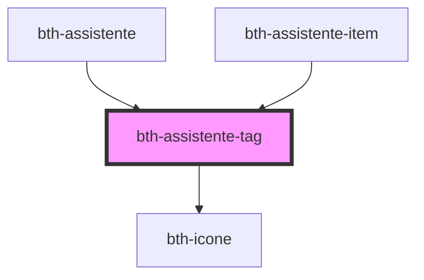

# bth-tag

<!-- Auto Generated Below -->

## Properties

| Property    | Attribute   | Description                   | Type      | Default     |
| ----------- | ----------- | ----------------------------- | --------- | ----------- |
| `ativo`     | `ativo`     | Está ativo?                   | `boolean` | `false`     |
| `descricao` | `descricao` | Descrição                     | `string`  | `undefined` |
| `link`      | `link`      | É link?                       | `boolean` | `false`     |
| `lock`      | `lock`      | Desativar click               | `boolean` | `false`     |
| `pasta`     | `pasta`     | Visualizar como pasta/folder? | `boolean` | `false`     |

## Events

| Event        | Description                | Type               |
| ------------ | -------------------------- | ------------------ |
| `tagClicked` | É emitido ao clicar na tag | `CustomEvent<any>` |

## Dependencies

### Used by

 - [bth-assistente](..)
 - [bth-assistente-item](../assistente-item)

### Depends on

- [bth-icone](../../comuns/icone)

### Graph

----------------------------------------------

Esta documentação é gerada automáticamente pelo StencilJS =)
