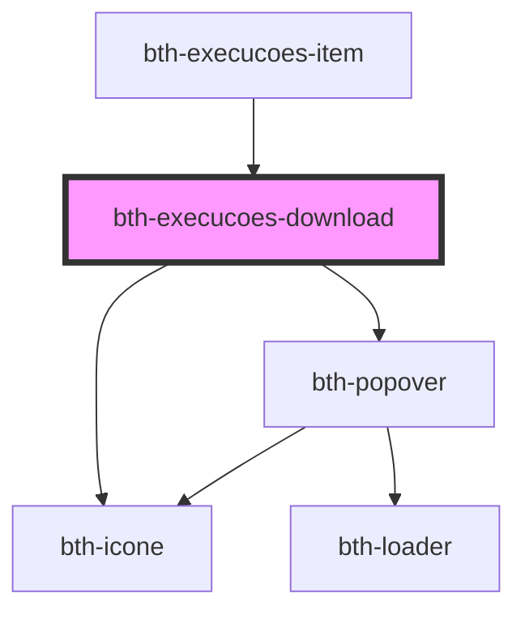

# execucoes-download

<!-- Auto Generated Below -->

## Properties

| Property             | Attribute              | Description                             | Type      | Default     |
| -------------------- | ---------------------- | --------------------------------------- | --------- | ----------- |
| `artefatoTipo`       | `artefato-tipo`        | Tipo do artefato                        | `string`  | `undefined` |
| `assinadorApi`       | `assinador-api`        | base url do assinador                   | `string`  | `undefined` |
| `concluidaEm`        | --                     | Data em que a execução foi concluída    | `Date`    | `undefined` |
| `conclusaoTipoValor` | `conclusao-tipo-valor` | Tipo de conclusão da execução           | `string`  | `undefined` |
| `execucaoId`         | `execucao-id`          | ID da execução                          | `string`  | `undefined` |
| `execucoesApi`       | `execucoes-api`        | base url de execucoes                   | `string`  | `undefined` |
| `gerouResultado`     | `gerou-resultado`      | Indica se a execução gerou um resultado | `boolean` | `undefined` |
| `mensagemConclusao`  | `mensagem-conclusao`   | Mensagem de conclusão da execução       | `string`  | `undefined` |
| `propriedades`       | `propriedades`         | Propriedades da execução                | `any`     | `undefined` |
| `protocolo`          | `protocolo`            | Protocolo associado à execução          | `string`  | `undefined` |
| `statusDescricao`    | `status-descricao`     | Status atual da execução                | `string`  | `undefined` |
| `statusValor`        | `status-valor`         | Status atual da execução                | `string`  | `undefined` |

## Events

| Event          | Description         | Type               |
| -------------- | ------------------- | ------------------ |
| `errorClicked` | É emitido ao clicar | `CustomEvent<any>` |

## Dependencies

### Used by

 - [bth-execucoes-item](../execucoes-item)

### Depends on

- [bth-icone](../../../comuns/icone)
- [bth-popover](../../../popover)

### Graph

----------------------------------------------

Esta documentação é gerada automáticamente pelo StencilJS =)
