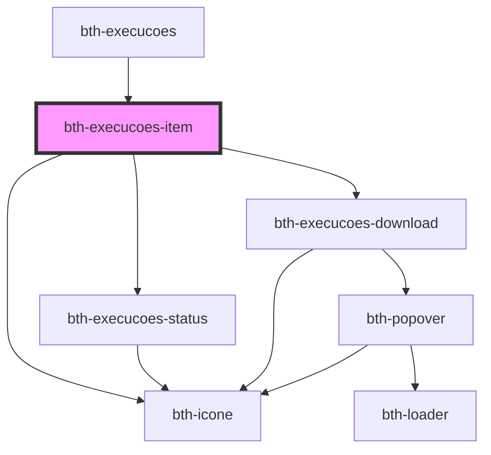

# bth-execucoes-item

<!-- Auto Generated Below -->

## Properties

| Property             | Attribute              | Description                              | Type      | Default     |
| -------------------- | ---------------------- | ---------------------------------------- | --------- | ----------- |
| `artefatoTipo`       | `artefato-tipo`        | Tipo do artefato                         | `string`  | `undefined` |
| `artefatoVersao`     | `artefato-versao`      | Versão do artefato                       | `string`  | `undefined` |
| `assinadorApi`       | `assinador-api`        | base url do assinador                    | `string`  | `undefined` |
| `autor`              | `autor`                | Autor da execução                        | `string`  | `undefined` |
| `concluidaEm`        | --                     | Data em que a execução foi concluída     | `Date`    | `undefined` |
| `conclusaoTipoValor` | `conclusao-tipo-valor` | Tipo de conclusão da execução            | `string`  | `undefined` |
| `consultaApi`        | `consulta-api`         | base url de consulta                     | `string`  | `undefined` |
| `duracaoValor`       | `duracao-valor`        | Duração da execução em milissegundos     | `number`  | `undefined` |
| `execucao`           | `execucao`             | objeto contendo a informação da execucao | `any`     | `undefined` |
| `execucaoId`         | `execucao-id`          | ID da execução                           | `string`  | `undefined` |
| `execucoesApi`       | `execucoes-api`        | base url de execucoes                    | `string`  | `undefined` |
| `gerouResultado`     | `gerou-resultado`      | Indica se a execução gerou um resultado  | `boolean` | `undefined` |
| `iniciadaEm`         | --                     | Data em que a execução foi iniciada      | `Date`    | `undefined` |
| `mensagemConclusao`  | `mensagem-conclusao`   | Mensagem de conclusão da execução        | `string`  | `undefined` |
| `propriedades`       | `propriedades`         | Propriedades da execução                 | `any`     | `undefined` |
| `protocolo`          | `protocolo`            | Protocolo associado à execução           | `string`  | `undefined` |
| `statusDescricao`    | `status-descricao`     | Status atual da execução                 | `string`  | `undefined` |
| `statusValor`        | `status-valor`         | Status atual da execução                 | `string`  | `undefined` |
| `visibilidadeValor`  | `visibilidade-valor`   | Visibilidade da execução                 | `string`  | `undefined` |

## Dependencies

### Used by

 - [bth-execucoes](..)

### Depends on

- [bth-execucoes-status](../execucoes-status)
- [bth-icone](../../../comuns/icone)
- [bth-execucoes-download](../execucoes-download)

### Graph

----------------------------------------------

Esta documentação é gerada automáticamente pelo StencilJS =)
