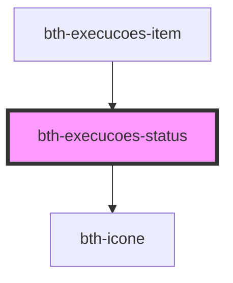

# bth-execucoes-status

<!-- Auto Generated Below -->

## Properties

| Property             | Attribute              | Description                             | Type     | Default     |
| -------------------- | ---------------------- | --------------------------------------- | -------- | ----------- |
| `artefatoVersao`     | `artefato-versao`      | Versão do artefato gerado pela execução | `string` | `undefined` |
| `autor`              | `autor`                | Autor da execução                       | `string` | `undefined` |
| `conclusaoTipoValor` | `conclusao-tipo-valor` | Tipo de conclusão da execução           | `string` | `undefined` |
| `propriedades`       | `propriedades`         | Propriedades da execução                | `any`    | `undefined` |
| `statusDescricao`    | `status-descricao`     | Status atual da execução                | `string` | `undefined` |
| `statusValor`        | `status-valor`         | Status atual da execução                | `string` | `undefined` |
| `visibilidadeValor`  | `visibilidade-valor`   | Visibilidade da execução                | `string` | `undefined` |

## Dependencies

### Used by

 - [bth-execucoes-item](../execucoes-item)

### Depends on

- [bth-icone](../../../comuns/icone)

### Graph

----------------------------------------------

Esta documentação é gerada automáticamente pelo StencilJS =)
