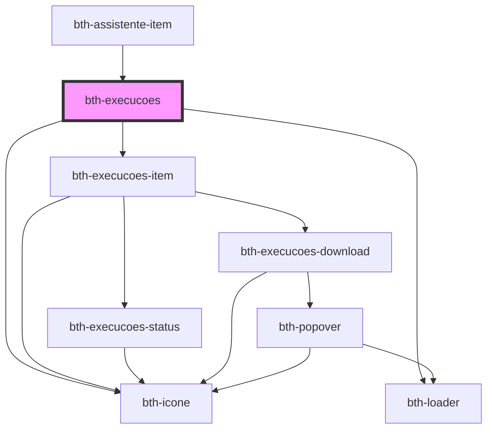

# bth-execucoes

<!-- Auto Generated Below -->

## Properties

| Property        | Attribute       | Description                                                                                            | Type                  | Default     |
| --------------- | --------------- | ------------------------------------------------------------------------------------------------------ | --------------------- | ----------- |
| `assinadorApi`  | `assinador-api` | URL para a api do assinador. Por padrão irá obter do env.js                                            | `string`              | `undefined` |
| `authorization` | --              | Configuração de autorização. É necessária para o componente poder realizar autentizar com os serviços. | `AuthorizationConfig` | `undefined` |
| `consultaApi`   | `consulta-api`  | URL para a api de consulta. Por padrão irá obter do env.js                                             | `string`              | `undefined` |
| `execucaoId`    | `execucao-id`   | Identificador da extensão                                                                              | `string`              | `undefined` |
| `execucoesApi`  | `execucoes-api` | URL para a api de execucoes. Por padrão irá obter do env.js                                            | `string`              | `undefined` |

## Dependencies

### Used by

 - [bth-assistente-item](../assistente-item)

### Depends on

- [bth-execucoes-item](execucoes-item)
- [bth-icone](../../comuns/icone)
- [bth-loader](../../comuns/loader)

### Graph

----------------------------------------------

Esta documentação é gerada automáticamente pelo StencilJS =)
