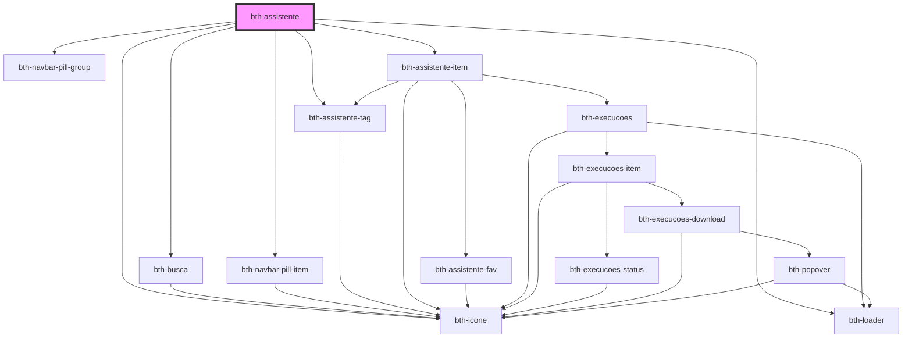

# bth-assistente

<!-- Auto Generated Below -->

## Properties

| Property        | Attribute        | Description                                                                                            | Type                  | Default     |
| --------------- | ---------------- | ------------------------------------------------------------------------------------------------------ | --------------------- | ----------- |
| `assistenteApi` | `assistente-api` | URL para a api de notificações. Por padrão irá obter do env.js                                         | `string`              | `undefined` |
| `authorization` | --               | Configuração de autorização. É necessária para o componente poder realizar autentizar com os serviços. | `AuthorizationConfig` | `undefined` |

## Dependencies

### Depends on

- [bth-busca](../comuns/busca)
- [bth-navbar-pill-group](../comuns/navbar-pill/navbar-pill-group)
- [bth-navbar-pill-item](../comuns/navbar-pill/navbar-pill-item)
- [bth-assistente-tag](assistente-tag)
- [bth-assistente-item](assistente-item)
- [bth-icone](../comuns/icone)
- [bth-loader](../comuns/loader)

### Graph

----------------------------------------------

Esta documentação é gerada automáticamente pelo StencilJS =)
