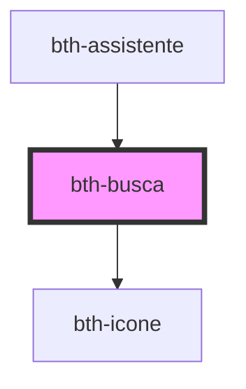

# bth-busca

<!-- Auto Generated Below -->

## Properties

| Property | Attribute | Description | Type     | Default |
| -------- | --------- | ----------- | -------- | ------- |
| `delay`  | `delay`   | Delay       | `number` | `500`   |

## Events

| Event         | Description                 | Type               |
| ------------- | --------------------------- | ------------------ |
| `buscaSubmit` | É emitido ao realizar busca | `CustomEvent<any>` |

## Dependencies

### Used by

 - [bth-assistente](../../assistente)

### Depends on

- [bth-icone](../icone)

### Graph

----------------------------------------------

Esta documentação é gerada automáticamente pelo StencilJS =)
