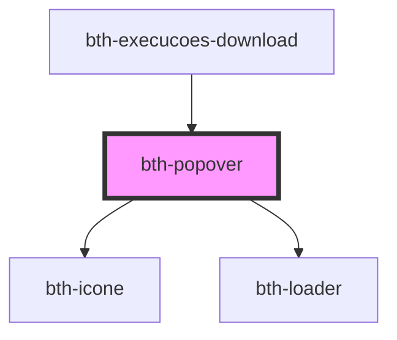

# bth-popover

<!-- Auto Generated Below -->

## Properties

| Property   | Attribute  | Description                              | Type     | Default     |
| ---------- | ---------- | ---------------------------------------- | -------- | ----------- |
| `content`  | `content`  | Conteudo do popover                      | `string` | `undefined` |
| `position` | `position` | Posição do popover em relação ao trigger | `string` | `'bottom'`  |

## Dependencies

### Used by

 - [bth-execucoes-download](../assistente/execucoes/execucoes-download)

### Depends on

- [bth-icone](../comuns/icone)
- [bth-loader](../comuns/loader)

### Graph

----------------------------------------------

Esta documentação é gerada automáticamente pelo StencilJS =)
